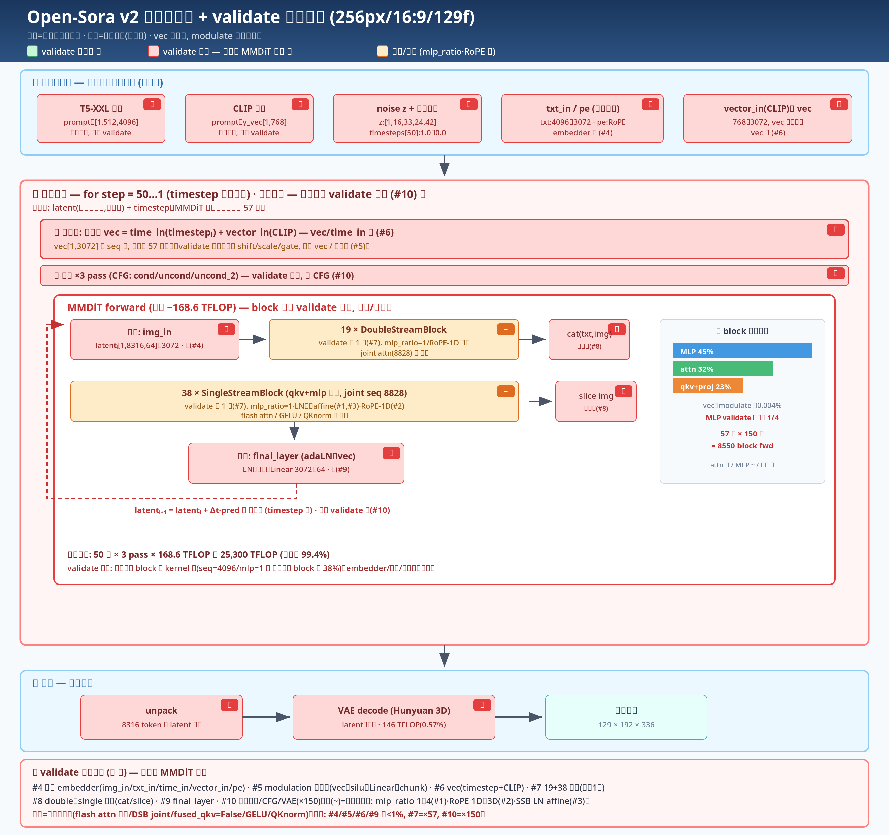
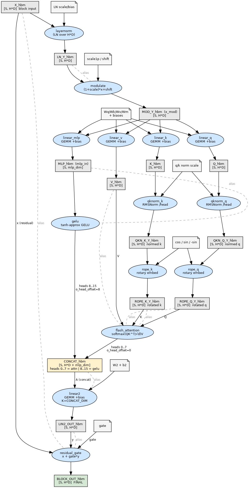
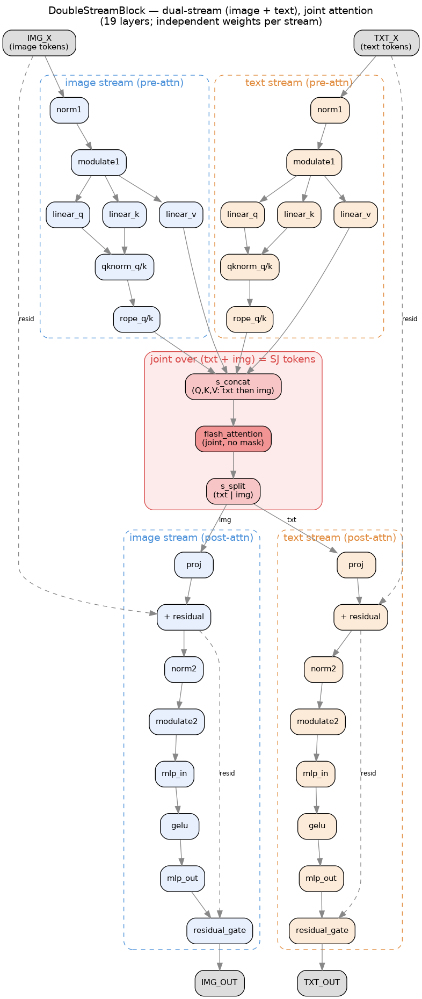

# Accelerating Open-Sora on PLENA

_2026-06-07_

---

## 1. What We Are Accelerating

The target of this work is the **Open-Sora v2** model itself — an open-source text-to-video diffusion Transformer. Given a text prompt, the model generates a short video clip; in the configuration studied here it produces a **256px, 16:9, 129-frame** clip.

A single generation is an iterative denoising process. Each run proceeds in three stages:

1. **Text encoding.** The prompt is encoded by T5-XXL and CLIP into conditioning vectors (plus the timestep and a few RoPE/embedding helpers).
2. **MMDiT forward — the denoising backbone.** This is the multimodal diffusion Transformer that is invoked repeatedly: roughly **50 timesteps × 3 CFG passes** (conditional / unconditional / combined). Every invocation runs the full MMDiT stack on the latent.
3. **VAE decode.** The final latent is decoded by a 3D VAE into the output pixel frames.

The overall inference flow is shown below.

The MMDiT forward stage is run once per timestep per CFG pass and operates on a **joint sequence of 8828 tokens** (8316 image tokens + 512 text tokens), with hidden size 3072 across 24 heads. Because it is executed on the order of 150 times per generation while the encoder and decoder run only once, it is this stage — not text encoding or VAE decoding — that determines inference cost. The rest of this report quantifies exactly how dominant it is and drills down to the single component we set out to accelerate.

---

## 2. Where the Compute Is

### 2.1 Whole-model breakdown

Counting FLOPs across a full generation (~50 timesteps × 3 CFG passes), MMDiT overwhelmingly dominates:

| Stage | FLOP | Share |
|---|---|---|
| **MMDiT forward** | **25,300 TFLOP** | **99.40%** |
| VAE decode | 146 TFLOP | 0.58% |
| T5-XXL / CLIP / embedder / unpack | ~5 TFLOP | 0.02% |

One MMDiT forward pass is **168.6 TFLOP**; multiplied by ~150 invocations this becomes the 25,300 TFLOP that defines inference cost. **Accelerating Open-Sora is therefore equivalent to accelerating the MMDiT forward pass** — the text encoder and VAE decoder, run only once each, are together below 0.6% and not worth optimizing.

### 2.2 Inside one MMDiT pass

A single MMDiT pass is a stack of transformer blocks plus a small output head:

| Component | Count | FLOP / block | Total / pass | Share of pass |
|---|---|---|---|---|
| **SingleStreamBlock** | **38** | 2.96 TFLOP | **112.4 TFLOP** | **66.6%** |
| **DoubleStreamBlock** | 19 | 2.96 TFLOP | 56.2 TFLOP | 33.3% |
| final_layer (adaLN + output proj) | 1 | 0.34 TFLOP | 0.34 TFLOP | 0.2% |
| **MMDiT pass total** | | | **168.9 TFLOP** | 100% |

Two facts stand out:

1. **A SingleStreamBlock and a DoubleStreamBlock cost essentially the same per block (~2.96 TFLOP).** The DoubleStreamBlock runs two streams (image + text) plus a joint attention; the SingleStreamBlock runs one fused stream over the already-concatenated joint sequence — they work out to the same per-block cost.
2. **There are twice as many SingleStreamBlocks (38) as DoubleStreamBlocks (19).** So the single-stream layers carry **two-thirds of the entire MMDiT pass**, while the final_layer is negligible (0.2%).

→ **The SingleStreamBlock is the heaviest part of MMDiT, and therefore of the whole model.** This is the block we target for acceleration; the rest of the report analyzes it in detail. (The DoubleStreamBlock is structurally two single-stream pipelines plus joint attention, so the same optimizations carry over; the final_layer is too small to matter.)

---

## 3. Focus: the Single- and Double-Stream Blocks

Together the SingleStreamBlock (66.6%) and DoubleStreamBlock (33.3%) make up **99.8% of every MMDiT pass**. The final_layer is 0.2%. **Our acceleration effort therefore concentrates entirely on these two block types** — they are where essentially all the compute lives, and they share the same set of kernels (norm, modulate, linear, qk-norm, RoPE, flash attention, gelu, residual), so improvements to one transfer directly to the other.

The two differ only in topology:

- **SingleStreamBlock** runs **one fused stream** over the already-concatenated joint sequence (8828 tokens). One norm → modulate → q/k/v linear → qk-norm → RoPE → flash attention → fused proj+mlp (linear2) → residual.
- **DoubleStreamBlock** runs **two independent streams** (image + text, separate weights). Each stream does its own pre-attention path, then the streams are **concatenated into a single joint sequence for one shared flash attention**, split back apart, and each runs its own post-attention path (proj, mlp, residual).

The heaviest kernel in **both** blocks is the **joint flash attention** — full bidirectional attention over the long sequence (no causal mask, no KV cache), which is why it dominates the matmul and vector work in either topology.

### 3.1 SingleStreamBlock structure

### 3.2 DoubleStreamBlock structure

---

## 4. GPU Baseline: TileLang vs. PyTorch on A100

We compiled both blocks at the **real Open-Sora v2 dimensions** (hidden 3072, 24 heads, mlp_ratio = 4), padding the sequence dimensions to multiples of 1024:

- **SingleStreamBlock** — joint sequence S = 9216 (8828 → padded to 9216).
- **DoubleStreamBlock** — image stream 9216 (8316 → 9216), text stream 1024 (512 → 1024), joint = 10240.

Both sides are run at **batch size = 4**. This is required to keep the A100 fully utilized: in the TileLang schedule, every SM must be given work, which means the launch grid must expose at least as many blocks as there are SMs (≥ 96). A single batch does not produce enough blocks to cover all SMs, so we use a batch of 4, which pushes the block count past the SM threshold and saturates the GPU. This batch-4 shape is the configuration used for all comparisons below.

We first establish the **GPU baseline** on an **NVIDIA A100-80GB** (bf16, batch = 4), measuring our own TileLang implementation of each block against the standard PyTorch + SDPA reference. Both run on the same A100; this isolates the TileLang kernel quality on a GPU before we move the design onto PLENA. Latency, average power, and energy per block are reported below.

**Correctness.** Both TileLang implementations match the PyTorch reference to a max-abs-diff of **0.0156** — the expected bf16 rounding magnitude, and identical to the batch-1 result, confirming that the batch-4 extension introduces no error.

**SSB** (`bench_ssb.py`)

| Impl. | Latency | Avg power | Energy / block |
|---|---|---|---|
| PyTorch + SDPA | **73.4 ms** | 393 W | **28.9 J** |
| TileLang | 85.1 ms | 388 W | 33.0 J |
| Ratio | 0.86× (slower) | slightly lower | 0.87× |

**DSB** (`bench_dsb.py`)

| Impl. | Latency | Avg power | Energy / block |
|---|---|---|---|
| PyTorch + SDPA | **87.4 ms** | 391 W | **34.2 J** |
| TileLang | 101.1 ms | 440 W | 44.5 J |
| Ratio | 0.86× (slower) | higher | 0.77× |

**Reading the result.** On the A100, our TileLang kernels land at **0.86×** the speed of PyTorch + SDPA for both blocks, at comparable (SSB) or somewhat higher (DSB) power. This sets the GPU reference point: a hand-written TileLang schedule on the A100 is within ~15% of the vendor library. The next sections move this same workload onto PLENA and analyze where its cycles and energy go.

---

## 5. GPU-Equivalent Compute: Choosing the PLENA Configuration

The A100 comparison in §4 is only fair if the two chips are matched on raw matrix-compute resources. This section counts the multiply-accumulate (MAC) units on each side and uses that count to **fix the PLENA hardware configuration** for all measurements in this report.

### 5.1 A100 MAC count

The A100 is built from a hierarchy of multiply-accumulate arrays:

- **108 SMs**, each with **4 Tensor Cores** → **432 Tensor Cores** total.
- Each Tensor Core performs **256 MACs per cycle** for BF16/FP16.

$$\text{A100 MACs} = 108 \times 4 \times 256 = 110{,}592 \text{ MAC}$$

We cross-check this count against the published spec. Counting one MAC as 2 FLOPs (NVIDIA's convention) at the 1.41 GHz boost clock:

$$110{,}592 \times 2 \times 1.41\,\text{GHz} = 312\ \text{TFLOPS (BF16)}$$

which matches NVIDIA's published **312 TFLOPS** BF16/FP16 Tensor Core peak exactly — confirming the 256-MAC-per-Tensor-Core count.

### 5.2 PLENA per-device MAC count and the multi-device match

A single PLENA device is a systolic array of dimension **BLEN × MLEN**, with MLEN fixed at 1024. We run each device at **BLEN = 8**, so one device holds

$$\text{PLENA MACs (per device)} = 8 \times 1024 = 8{,}192 \text{ MAC}$$

This is deliberately small — one PLENA device has only ~7% of the A100's MAC budget. Rather than grow a single die to A100 scale, PLENA matches the GPU by **replicating small devices and running them in parallel**. To reach the A100's MAC budget we deploy **12 devices**:

$$12 \times 8{,}192 = 98{,}304 \text{ MAC} \;\approx\; 0.89\times \text{ the A100's } 110{,}592$$

Twelve BLEN-8 devices therefore put PLENA in the same hardware class as one A100 (within ~11% on MAC count), while each device stays small, low-power, and high-yield. This 12-device, BLEN-8 configuration is the deployment behind §6; the per-device analytic numbers come from `plena_settings.toml` (BLEN = 8) and the two per-block reports.

At BLEN = 8 and the 1.0 GHz clock, one device's peak BF16 throughput is $8{,}192 \times 2 \times 1.0\,\text{GHz} = 16.4$ TFLOPS; twelve devices give **197 TFLOPS** aggregate.

### 5.3 Side-by-side

| | NVIDIA A100 | PLENA (12 × BLEN-8 devices) | Ratio (PLENA / A100) |
|---|---|---|---|
| MAC array | 432 TC × 256 = **110,592 MAC** | 12 × (8 × 1024) = **98,304 MAC** | **0.89×** |
| Clock | 1.41 GHz | 1.0 GHz | 0.71× |
| **Peak BF16** | **312 TFLOPS** | **197 TFLOPS** | **0.63×** |

The 12-device PLENA deployment carries **~11% fewer MAC units** than an A100 and runs at a **lower clock (0.71×)**, for an aggregate peak BF16 throughput of **0.63×** the A100's. Both are on a **7 nm node** (the A100 is NVIDIA's Ampere GA100 on TSMC N7), so the comparison reflects architecture and dataflow, not a process gap. §6 places PLENA's per-block latency and energy at this 12-device configuration directly against the A100 baseline of §4.

---

## 6. PLENA vs. A100

We place PLENA's per-block latency and energy (analytic model, **BLEN = 8, SIMT = 1, batch = 4**) directly against the A100 baseline from §4. The A100 reference is the **PyTorch + SDPA** number — the fastest GPU result.

The scaling knob here is the **device count**, not SIMT. Each PLENA device is small (BLEN = 8, 8,192 MACs), so a single device is far slower than the A100; we close the gap by running many devices in parallel. Under ideal linear scaling, N devices divide latency by N and multiply average power by N, while **total energy is unchanged** (the same work is done, just spread across more silicon). We sweep the device count 1 → 12, where 12 devices match the A100's MAC budget (§5.3). Speedup is `A100 latency / PLENA latency`; the energy ratio is `A100 energy / PLENA energy` (> 1 means PLENA uses less energy). Because energy does not change with device count, the energy ratio is constant across the sweep.

### 6.1 SingleStreamBlock (SSB)

Per block, batch = 4. PLENA: BLEN = 8, SIMT = 1, swept over device count. Energy is constant across device count (8.44 J); latency falls as 1/N and average power rises as N.

| Config | Latency (ms) | Energy (J) | Avg power (W) | Speedup vs A100 | Energy ratio vs A100 |
|---|---|---|---|---|---|
| **A100 (PyTorch+SDPA)** | **73.4** | **28.9** | 393 | 1.00× | 1.00× |
| PLENA — 1 device | 1077.68 | 8.44 | 7.8 | 0.07× | **3.42×** |
| PLENA — 2 devices | 538.84 | 8.44 | 15.6 | 0.14× | 3.42× |
| PLENA — 4 devices | 269.42 | 8.44 | 31.2 | 0.27× | 3.42× |
| PLENA — 8 devices | 134.71 | 8.44 | 62.4 | 0.54× | 3.42× |
| **PLENA — 12 devices** | **89.81** | **8.44** | **93.6** | **0.82×** | **3.42×** |

### 6.2 DoubleStreamBlock (DSB)

Per block, batch = 4. PLENA energy is constant across device count (9.75 J).

| Config | Latency (ms) | Energy (J) | Avg power (W) | Speedup vs A100 | Energy ratio vs A100 |
|---|---|---|---|---|---|
| **A100 (PyTorch+SDPA)** | **87.4** | **34.2** | 391 | 1.00× | 1.00× |
| PLENA — 1 device | 1257.68 | 9.75 | 7.8 | 0.07× | **3.51×** |
| PLENA — 2 devices | 628.84 | 9.75 | 15.6 | 0.14× | 3.51× |
| PLENA — 4 devices | 314.42 | 9.75 | 31.2 | 0.28× | 3.51× |
| PLENA — 8 devices | 157.21 | 9.75 | 62.4 | 0.56× | 3.51× |
| **PLENA — 12 devices** | **104.81** | **9.75** | **93.6** | **0.83×** | **3.51×** |

### 6.3 Takeaways

- **Energy is the decisive win, independent of device count.** PLENA uses **3.4× (SSB) / 3.5× (DSB) less energy per block** than the A100, and — because adding devices does not change total energy — this advantage holds at every point on the sweep. PLENA's average power (8–94 W per device aggregate) is far below the A100's ~390 W.
- **Latency reaches ~0.8× of A100 at the 12-device match.** With 12 BLEN-8 devices (≈ the A100 MAC budget), PLENA runs each block at **0.82× (SSB)** and **0.83× (DSB)** of A100 wall-clock — within ~20% — at SIMT = 1, with no reliance on SIMT.
- **Device scaling is linear and clean.** Latency falls as 1/N with device count while energy stays fixed, so the configuration can be dialed to any latency target by adjusting how many devices are deployed, trading aggregate power for speed at constant energy.

**Bottom line:** at a matched 7 nm MAC budget (12 BLEN-8 devices ≈ one A100), PLENA delivers **~3.4–3.5× better energy efficiency** on the Open-Sora blocks and reaches **~0.8× of A100 latency** using device-level parallelism alone (SIMT = 1).

---

## 7. Memory and HBM Bandwidth

A latency comparison only holds if the accelerator is genuinely **compute-bound** and not secretly limited by memory traffic. This section shows that the Open-Sora blocks are firmly compute-bound on PLENA, with large headroom on HBM bandwidth.

### 7.1 Bandwidth available

PLENA moves data between HBM and the on-chip SRAMs over two DMA ports — a matrix port and a vector port — each one MLEN-wide (and VLEN-wide) per cycle:

$$\text{per-port BW} = 1024\ \text{B/cyc} \times 1.0\ \text{GHz} = 1024\ \text{GB/s}, \qquad \text{total} \approx 2{,}048\ \text{GB/s}$$

This is comparable to the A100-80GB's HBM2e bandwidth (**2,039 GB/s** SXM / 1,940 GB/s PCIe), so the two are in the same memory-bandwidth class — the comparison is not biased by giving PLENA an unrealistic memory subsystem.

### 7.2 Traffic and time per block (batch = 4)

All HBM tensors are stored in MX format (E4M3 element + E8M0 block scale, block = 8), so the byte count includes a 1.25× scale overhead. Dividing the per-block HBM traffic by the available bandwidth gives the memory time:

| Block | HBM traffic / block | Memory time | Compute time (1 device) | Memory / compute |
|---|---|---|---|---|
| SSB | 356 MB | 0.35 ms | 1077.7 ms | **0.03%** |
| DSB | 509 MB | 0.50 ms | 1257.7 ms | **0.04%** |

### 7.3 Worst-case HBM contention (one block split across 12 devices)

In the 12-device deployment a single block is **split across the 12 devices by TileLang**, not replicated. The total HBM traffic is therefore **fixed — it is exactly one block's worth (356 MB SSB / 509 MB DSB)** — just partitioned so each device fetches its 1/12 share. What changes is that all 12 devices want to read from the shared HBM at the same time, each at its full port bandwidth, so the accesses must queue.

We take the most pessimistic queuing model: a single shared HBM pool of **2,039 GB/s**, with every device's traffic **fully serialized through it** (round-robin, one device served at a time — no parallel HBM access at all). The HBM is then busy for

$$t_\text{HBM busy} = \frac{\text{block traffic}}{2{,}039\ \text{GB/s}}$$

and we compare that against the per-block latency at the 12-device configuration (compute / 12):

| Block | Total traffic (fixed) | HBM busy time (fully serialized @ 2,039 GB/s) | Block latency (12 devices) | **HBM duty cycle** |
|---|---|---|---|---|
| SSB | 356 MB | 0.17 ms | 89.81 ms | **0.19%** |
| DSB | 509 MB | 0.24 ms | 104.81 ms | **0.23%** |

Even in this worst case — all HBM accesses pushed through one 2,039 GB/s pipe with zero concurrency — the shared HBM is **busy only ~0.2% of the wall-clock**, leaving **~430–530× headroom**. Because the work is *split* rather than replicated, the total bytes to move never grow with device count; queuing only reorders these few hundred MB in time, and there is far more than enough bandwidth to drain the queue long before the compute needs the data. HBM bandwidth is sufficient under the most pessimistic shared-pool, fully-serialized assumption.

### 7.4 Implication

Memory time is **three to four orders of magnitude smaller than compute time** for both blocks. Under the overlapped `total = max(compute, memory)` model every kernel is compute-bound, and the DMA traffic hides completely behind computation. Two consequences:

- The latency and energy numbers in §6 are governed entirely by the matrix/vector compute, not by memory — the HBM subsystem is never the bottleneck at this geometry.
- Device-level scaling (§6) does not stress aggregate bandwidth: as §7.3 shows, even 12 devices in parallel demand under 5 GB/s, ~0.2% of one A100's HBM bandwidth.

This is expected for the Open-Sora MMDiT blocks — they are dense, high-arithmetic-intensity GEMMs and attention over a long sequence, where each byte fetched from HBM is reused across many MAC operations. The workload is compute-bound by construction, which is exactly the regime a systolic matrix core is built to exploit.

---

## 8. Full MMDiT: End-to-End Analysis

The previous sections analyzed individual blocks. We now assemble the **complete MMDiT forward pass** — the structure that actually runs per denoising step. From the Open-Sora v2 inference config (`hidden_size=3072, num_heads=24, mlp_ratio=4`), one pass is:

$$\text{MMDiT pass} = 38 \times \text{SSB} + 19 \times \text{DSB} + 1 \times \text{final\_layer}$$

All three components were compiled to PLENA ISA at the real dimensions (mlp_ratio = 4) and analyzed identically (BLEN = 8, batch = 4). Per-block figures are taken from the three per-block reports; the pass total is `38 × SSB + 19 × DSB + 1 × final_layer`, run on the 12-device deployment (each block split across 12 devices: latency ÷12, energy unchanged), with blocks executed in sequence.

### 8.1 Per-component contribution (SIMT = 1)

| Component | Count | Latency share | Energy share |
|---|---|---|---|
| SingleStreamBlock | 38 | **63.1%** | 63.4% |
| DoubleStreamBlock | 19 | **36.8%** | 36.6% |
| final_layer | 1 | 0.03% | 0.03% |

The two stream-block types account for **99.97%** of the pass; the final layer is negligible, as anticipated in §2. This is why the acceleration effort concentrated on SSB and DSB.

### 8.2 Full-pass latency and energy (12 devices, batch = 4)

| SIMT | Latency (s) | Energy (J) | Avg power (W) |
|---|---|---|---|
| 1 | 5.41 | 506 | 93.6 |
| 2 | 4.72 | 499 | 105.6 |
| 4 | 4.38 | 495 | 113.0 |
| 8 | 4.21 | 493 | 117.2 |
| 16 | 4.12 | 492 | 119.4 |
| 32 | 4.08 | 492 | 120.5 |

Energy is essentially flat across SIMT (~492–506 J); SIMT only trims the vector tail of latency, with the pass becoming matmul-bound past SIMT-4.

### 8.3 Full MMDiT vs. A100

Against the same MMDiT pass on an A100 (PyTorch + SDPA per-block baseline from §4, summed over 38 SSB + 19 DSB; the final layer is below measurement noise):

| | A100 (PyTorch+SDPA) | PLENA (12 dev, SIMT = 1) | PLENA (12 dev, SIMT = 32) |
|---|---|---|---|
| Latency / pass | **4.45 s** | 5.41 s (0.82×) | 4.08 s (**1.09×**) |
| Energy / pass | **1,748 J** | **506 J** (3.45× less) | **492 J** (3.55× less) |
| Avg power | 393 W | 93.6 W | 120.5 W |

**End-to-end result.** On a full MMDiT forward pass — the structure invoked ~150× per video generation — a 12-device PLENA deployment matched to the A100's MAC budget delivers:

- **~3.5× lower energy per pass** (506 J vs 1,748 J), holding at every SIMT width because device-level parallelism does not change total energy;
- **comparable latency** — 0.82× of the A100 at SIMT = 1, crossing to **1.09× (faster)** at SIMT = 32;
- at **a quarter of the average power** (94–120 W vs 393 W).

### 8.4 The full denoising loop (one video generation)

A single MMDiT pass is not the end-to-end cost — it runs inside the **denoising loop**. From the Open-Sora v2 256px inference config, one generation is **`num_steps = 50`** denoising steps, and each step issues **one** MMDiT forward whose batch carries the **classifier-free-guidance branches**: the sampler concatenates 3 conditioning versions of the latent (text-cond / image-cond / unconditional) into one batched forward. Combined with the batch-4 GPU-fill shape, the effective batch per forward is

$$\text{batch} = 3\ (\text{CFG}) \times 4\ (\text{GPU fill}) = \mathbf{12}.$$

So a generation is **50 steps × one MMDiT pass at batch = 12**. Scaling the per-pass numbers (linear in batch; energy independent of device count):

| | A100 (PyTorch+SDPA) | PLENA (12 dev, SIMT = 1) |
|---|---|---|
| Per pass (batch = 12) latency | 13.35 s | 16.22 s (0.82×) |
| Per pass (batch = 12) energy | 5,244 J | **1,518 J** (3.45× less) |
| **Full generation** (50 passes) latency | **667.5 s** (11.1 min) | 810.8 s (13.5 min, 0.82×) |
| **Full generation** energy | **262.2 kJ** | **75.9 kJ** (3.45× less) |
| Avg power | 393 W | 93.6 W |

**End-to-end bottom line.** Generating one 256px clip drives the MMDiT denoising backbone for 50 steps at batch 3×4 = 12. A 12-device PLENA deployment, matched to one A100's MAC budget, completes this at **0.82× the speed** of the A100 (13.5 min vs 11.1 min) while consuming **75.9 kJ vs 262.2 kJ — a 3.45× reduction in generation energy**, at a quarter of the average power. Raising SIMT to 32 closes the latency gap (the per-pass crossover to >1× shown in §8.3 carries through the loop unchanged), so PLENA can match or beat A100 wall-clock at the same ~3.5× energy advantage. Since MMDiT is 99.4% of generation FLOPs (§2), this is effectively the energy profile of the whole model.

---

# Appendix A — Power Model Validation against George's Analytic Model

The per-unit power figures used throughout this report are bottom-up estimates anchored to the BF16→FP32 / 7 nm point (1 mW/MAC, 0.5 mW/vector-lane, 0.055 pJ/bit SRAM). To check them, we compare against George's independent PLENA analytic power model, which fits **Synopsys Design Compiler synthesis results** of parameterized RTL for the same four units. Evaluated at the same geometry (BLEN = 8, MLEN = 1024, VLEN = 1024):

| Unit | Ours (bottom-up) | George (DC-synthesis fit) | George / Ours |
|---|---|---|---|
| **MCU (matrix core)** | 8.2 W | 279 W | **34×** (George's M²·K bug) |
| **Vector unit** | 0.51 W | 0.37 W (poly extrap.) / 0.54 W (linear synth points) | **~1×** |
| **Matrix SRAM** | 0.90 W | 1.15 W | 1.28× |
| **Vector SRAM** | 0.90 W | 0.57 W | 0.63× |

**How to read this.**

- **Vector and both SRAMs agree to within ~1.3×.** George's vector model is fit to real DC-synthesis points (VLEN 8→64 measured at 4.3→34.0 mW, i.e. ~0.53 mW/lane); our 0.5 mW/lane lands almost exactly on that line. The SRAMs differ only by the method (our Horowitz-derived 0.055 pJ/bit vs George's DC toggle-rate fit) and stay the same order of magnitude. These three units are therefore cross-validated against an independent RTL-synthesis source.

- **MCU differs by 34×, and here George is the one that is wrong.** George's MCU formula is `4.26e-3 · M² · K`, which scales as **M²** — physically incorrect for a systolic array, whose PE count (and hence power) is linear in **M·K**. George's own notes flag this ("uses only M=4 data; M≥8 had an RTL bug with inflated switching"), and even at M = 8 the M² term already inflates the result 34×; at large M it diverges to hundreds of kW. Our linear `1 mW × M·K` is the corrected form. (George's *area* model uses `M^0.77 · K^1.14` — near-linear — which independently confirms the power model's M² is the anomaly.)

**Caveat (applies to both models).** All of these are activity-factor = 1 synthesis-level figures, i.e. they assume the default (low) switching activity and do not annotate real toggle rates. George's notes recommend ×2–5 for realistic operational power; 7 nm FinFET literature puts dynamic:leakage ≈ 37:1 (so leakage is ~3% — small), but real switching can raise absolute dynamic power above the synthesis estimate. The **relative** PLENA-vs-A100 energy ratio is robust to this (both sides scale together); the **absolute** watt figures are best read as a lower-to-nominal bound.
