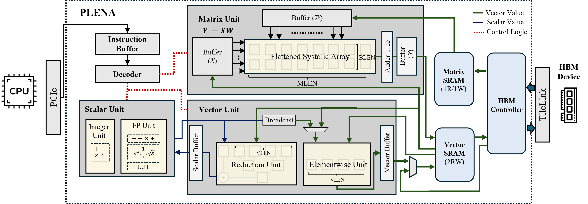

# PLENA: A Programmable Long-context Efficient Neural Accelerator

This repository contains the design and implementation of PLENA. 

## Publication
* Combating the Memory Walls: Optimization Pathways for Long-Context Agentic LLM Inference, [link](https://arxiv.org/abs/2509.09505)
  ```
    @misc{wu2025combatingmemorywallsoptimization,
        title={Combating the Memory Walls: Optimization Pathways for Long-Context Agentic LLM Inference}, 
        author={Haoran Wu and Can Xiao and Jiayi Nie and Xuan Guo and Binglei Lou and Jeffrey T. H. Wong and Zhiwen Mo and Cheng Zhang and Przemyslaw Forys and Wayne Luk and Hongxiang Fan and Jianyi Cheng and Timothy M. Jones and Rika Antonova and Robert Mullins and Aaron Zhao},
        year={2025},
        eprint={2509.09505},
        archivePrefix={arXiv},
        primaryClass={cs.AR},
        url={https://arxiv.org/abs/2509.09505}, 
    }
  ```




**ISA Summary:**  
[View Document on Notion](https://www.notion.so/Custom-ISA-1e228f1ee68e80d29f05ec130b72a3ce?source=copy_link)

**Progress Report:**  
[View Document on Notion](https://www.notion.so/Coprocessor-Project-Plan-1d628f1ee68e8052ab7dc51a36905c15?pvs=4)

**Design Space and Tuning Method:**  
[View Document](src/definitions/config.md)

**SystemVerilog RTL Format:**  
[LowRISC Format](https://github.com/lowRISC/style-guides)

## Prerequisite
```
nix
direnv 
echo 'eval "$(direnv hook bash)"' >> ~/.bashrc
source ~/.bashrc

```

## Configure your environment

```
direnv allow
nix develop
git submodule update --init --recursive
```

## Run Behavioral Simulation

```
just build-behave-sim [ Task to simulate e.g. linear]
```
Debug mode
```
just build-behave-sim-debug [ Task to simulate e.g. linear]
```


