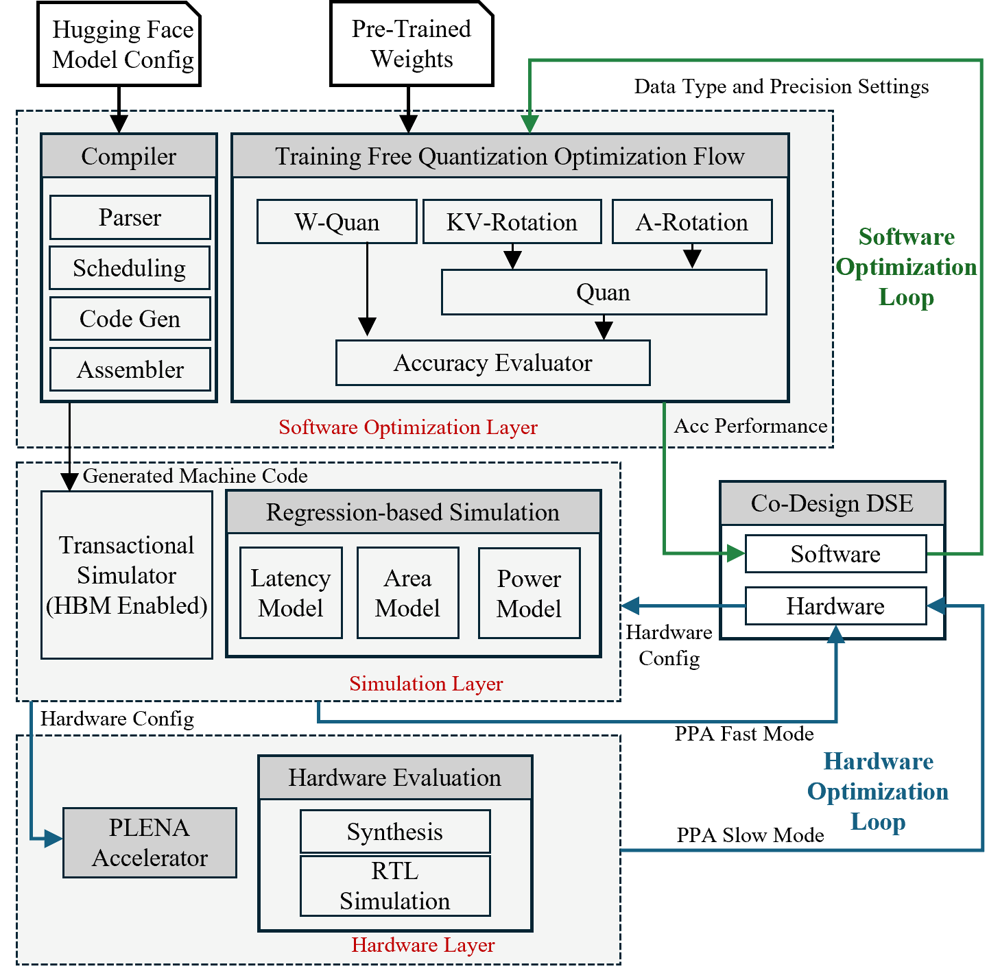

# PLENA Simulation System  
This repository contains the multi-level simulator system for **PLENA (Programmable Long-context Efficient Neural Accelerator)**.  
- **Transaction-level simulator** : The simulator models PLENA’s architectural behavior at a high level, enabling rapid exploration of design choices, memory hierarchies, and long-context LLM inference workflows without the overhead of cycle-accurate RTL simulation.
- **Analytical model for Performance, Power and Area (PPA)** : The analytical model estimates PLENA’s performance, power, and area characteristics based on architectural parameters and instruction latencies. This aims for fast estimation
- **Utilization model for systolic array** : analyse the utilization of the systolic array based on the architectural parameters and instruction latencies.



---

## PLENA Publication

If you use this simulator in your research, please cite the following paper:

* Combating the Memory Walls: Optimization Pathways for Long-Context Agentic LLM Inference, [link](https://arxiv.org/abs/2509.09505)

```bibtex
@misc{wu2025combatingmemorywallsoptimization,
  title        = {Combating the Memory Walls: Optimization Pathways for Long-Context Agentic LLM Inference},
  author       = {Haoran Wu and Can Xiao and Jiayi Nie and Xuan Guo and Binglei Lou and Jeffrey T. H. Wong and Zhiwen Mo and Cheng Zhang and Przemyslaw Forys and Wayne Luk and Hongxiang Fan and Jianyi Cheng and Timothy M. Jones and Rika Antonova and Robert Mullins and Aaron Zhao},
  year         = {2025},
  eprint       = {2509.09505},
  archivePrefix= {arXiv},
  primaryClass = {cs.AR},
  url          = {https://arxiv.org/abs/2509.09505}
}
```


## Prerequisite
```
nix
direnv 
echo 'eval "$(direnv hook bash)"' >> ~/.bashrc
source ~/.bashrc

```

## Configure your environment

```
direnv allow
nix develop
git submodule update --remote --merge
```

## Run Behavioral Simulation

```
just build-behave-sim [ Task to simulate e.g. linear]
```
Debug mode
```
just build-behave-sim-debug [ Task to simulate e.g. linear]
```


