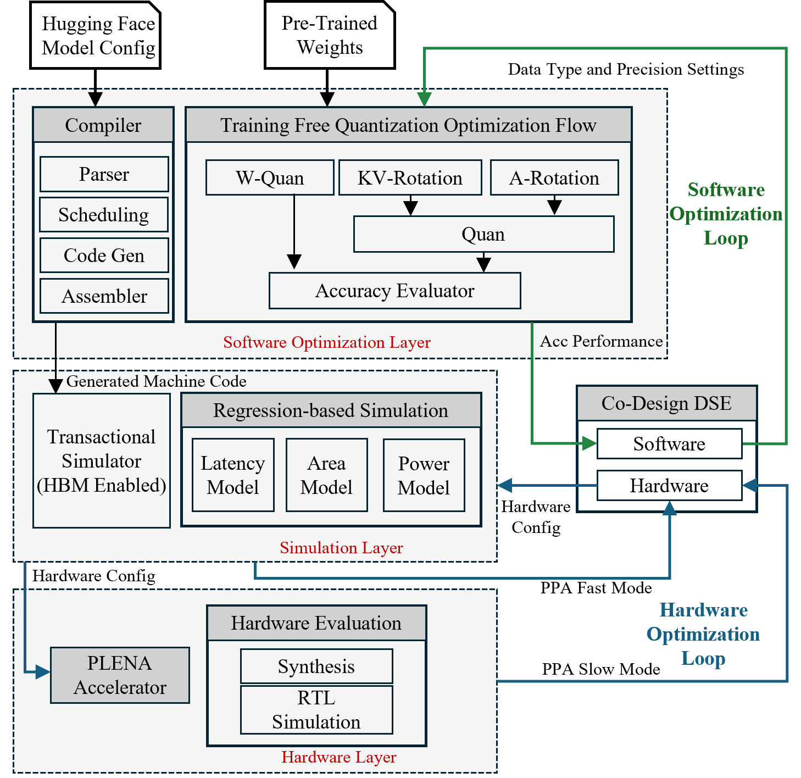

# PLENA Simulation System

<div align="center">
  
</div>

This repository contains the multi-level simulator system for **PLENA (Programmable Long-context Efficient Neural Accelerator)**.

## Overview

The PLENA Simulator provides three main components:

- **Transaction-level Simulator**: Models PLENA's architectural behavior at a high level, enabling rapid exploration of design choices, memory hierarchies, and long-context LLM inference workflows without the overhead of cycle-accurate RTL simulation.
- **Analytical Latency Model**: Provides fast estimation of PLENA's performance characteristics (TTFT, TPS) based on architectural parameters and instruction latencies for specified workloads.
- **Utilization Model**: Analyzes the utilization of the systolic array based on architectural parameters and instruction latencies, computing attainable vs theoretical FLOPS.



---

## PLENA Publication

If you use this simulator in your research, please cite the following paper:

**Combating the Memory Walls: Optimization Pathways for Long-Context Agentic LLM Inference**  
[arXiv:2509.09505](https://arxiv.org/abs/2509.09505)

```bibtex
@misc{wu2025combatingmemorywallsoptimization,
  title        = {Combating the Memory Walls: Optimization Pathways for Long-Context Agentic LLM Inference},
  author       = {Haoran Wu and Can Xiao and Jiayi Nie and Xuan Guo and Binglei Lou and Jeffrey T. H. Wong and Zhiwen Mo and Cheng Zhang and Przemyslaw Forys and Wayne Luk and Hongxiang Fan and Jianyi Cheng and Timothy M. Jones and Rika Antonova and Robert Mullins and Aaron Zhao},
  year         = {2025},
  eprint       = {2509.09505},
  archivePrefix= {arXiv},
  primaryClass = {cs.AR},
  url          = {https://arxiv.org/abs/2509.09505}
}
```

---

## Setup

There are two ways to get a working environment. **Option A (Docker)** is the
recommended path — you only need Docker installed, and it wraps the full toolchain
in a reproducible container. **Option B (Nix)** runs directly on your machine if you
prefer native development.

### Option A — Docker (recommended)

You only need Docker installed (no Nix or direnv on the host). All commands run from
the repository root. Your working tree is bind-mounted into the container at
`/workspace`, so edits on the host are picked up live and build artifacts persist
on the host.

**Prerequisites:**

- Docker Engine with the Compose plugin (`docker compose`)
- (Optional) NVIDIA Container Toolkit for CUDA support

**Build the image and open a shell:**

```bash
git submodule update --init --recursive   # once, on the host
just docker-dev
```

**Run a test directly (no interactive shell needed):**

```bash
just docker-test test-aten-linear            # run a just recipe in Docker
just docker-test test-aten-linear --mlen 128 # ...with args
```

The first emulator test compiles the Rust binary automatically (one-time, a few
minutes); it persists on the host and later runs reuse it.

**Common Docker commands** (see [`docker/README.md`](docker/README.md) for the full list):

| Command | Description |
|---------|-------------|
| `just docker-dev` | Build, start, and enter the dev container |
| `just docker-run <cmd>` | Run a command in the dev environment |
| `just docker-test <recipe> [args...]` | Run a `just` recipe in Docker |
| `just docker-down` | Stop containers |

**CUDA support:**

```bash
docker compose -f docker/docker-compose.yml --profile cuda up -d dev-cuda
docker compose -f docker/docker-compose.yml exec dev-cuda bash
```

> **Note:** The repository is bind-mounted from the host (owned by your host user)
> while the container runs as `root`. The image marks `/workspace` as a git
> `safe.directory` so Nix's flake evaluation doesn't fail with a dubious-ownership
> error. If you build a custom image, preserve that setting.

### Option B — Nix (native)

**Prerequisites:**

- `nix` package manager (with flakes enabled)
- `direnv` for environment management

```bash
# Install direnv hook in your shell
echo 'eval "$(direnv hook bash)"' >> ~/.bashrc
source ~/.bashrc
```

**Installation:**

```bash
# Allow direnv to load the environment
direnv allow

# Enter the development environment
nix develop

# Check out the revisions pinned by this Simulator commit
git submodule update --init --recursive
```

You are now in a shell with the full toolchain (Rust, Python 3.12, clang, cmake,
etc.) and can run any of the `just` commands below directly.

---

## Configuration

The simulator and emulator both use `plena_settings.toml` as the main configuration file for hardware parameters. This file contains:

- Hardware dimensions (MLEN, BLEN, VLEN, HLEN)
- Memory configuration (HBM, SRAM sizes)
- Instruction latencies
- Prefetch/writeback amounts

The configuration file supports two modes:
- `analytic`: Used by analytical models (latency and utilization)
- `transactional`: Used by the transaction-level emulator

Set the active mode in the `[MODE]` section of `plena_settings.toml`.

### Nemotron 3 Mamba exploration

The Nemotron 3 model separates architecture-independent work/traffic counting
from candidate-hardware timing. It uses the real Nano 30B-A3B layer pattern
(23 Mamba, 23 MoE, and 6 attention layers), explicit 128-wide attention heads,
and the complete persistent Mamba state size.

```bash
# FLOPs and logical bytes for the model body
just nemotron3-workload --phase decode --decode-tokens 4 --body-only

# Compare row-major/skewed projection layout, B/C broadcast, and 0/16/32/64 MiB caches
just nemotron3-dse --decode-tokens 4 --weight-precision nvfp4 \
  --json-out build/nemotron3_dse.json

# Replay the debug view of executable L_SCATTER_M and report FIFO/bank/spill counters
just projection-scatter-replay /path/to/nemotron3.lowered.json \
  --consumer-start-cycle 0 --json-out build/projection_scatter.json
```

The current PLENA cycle results remain uncalibrated to RTL. The RTX 5090
standalone-mixer path validates the real shape with a BF16 runtime state, staged
GPU kernel time, scan latency, and recurrent-state read traffic. The formal B200
full-model vLLM path instead reports FP32 recurrent state; the two paths are
kept separate rather than silently treating their state dtype as identical.
Neither path turns GPU time into PLENA cycles. Full-model GPU profiles should follow
[`doc/nemotron3_gpu_profile.schema.json`](doc/nemotron3_gpu_profile.schema.json);
`just nemotron3-profile-check <profile.json>` validates the stage mapping and
aggregates kernel time and DRAM traffic.

Standalone mixer deliveries can be validated without copying raw Nsight reports
into git:

```bash
uv run python -m analytic_models.performance.nemotron3_gpu_microprofile \
  /path/to/NEMOTRON3_NANO_5090 --json-out build/nemotron3_5090_mamba.json
```

The checked-in formal B200 campaign is complete: all 18 KDA stage captures,
six Nemotron layer-type NCU captures, four NSYS reports, 80 latency records,
3,013 routing events, and the final archive have been hash-validated. Validate
the normalized contract with:

```bash
just b200-formal-campaign-check --json-out build/b200-formal-campaign.json

# Additionally cross-check the locally ingested raw KDA Stage 2 subset.
just b200-formal-campaign-check \
  --kda-stage2-root /path/to/ingested-kda-stage2 \
  --json-out build/b200-formal-campaign-with-local-crosscheck.json
```

The formal summary constrains stage dominance, physical traffic, checkpoint
precision, and routing skew; it does not fit GPU milliseconds to PLENA cycles.
The optional local cross-check proves source revision/hash identity and
independently checks the KDA recurrent-core call counts and DRAM reads. That
older Stage 2 archive remains only an independent raw subset.

Run the exact routing replay and complete pre-RTL report with:

```bash
just nemotron3-routing-dse --json-out build/nemotron3-routing-dse.json
just nemotron3-formal-dse \
  --json-out build/nemotron3-formal-dse.json \
  --markdown-out build/nemotron3-formal-dse.md
```

The formal DSE uses the real mixed checkpoint map: default NVFP4 linear
weights, explicit BF16 Mamba/Attention projections, BF16 Mamba convolution,
norms, embedding, and LM head. It also fixes the L-Compute FIFO at the verified
64-value configuration. GPU physical/logical traffic ratios are reported as a
cross-check but are never applied as a PLENA timing multiplier.

The exact 127-step routing trace also drives an event-level MoE Matrix-cluster
DSE (`just nemotron3-moe-event-dse`). It couples every routed cache miss to a
finite weight buffer, one shared HBM server, asynchronous Expert/M/K compute,
and one shared reduction resource under a fixed 4096-PE budget. Ideal geometry
and transferred Shared-MoE cycle constants are reported separately; neither is
treated as direct Nemotron RTL calibration.

The first uncalibrated baseline and the exact GPU profiling request are recorded
in [`doc/NEMOTRON3_ANALYTIC_BASELINE_ZH.md`](doc/NEMOTRON3_ANALYTIC_BASELINE_ZH.md)
and [`doc/NEMOTRON3_GPU_PROFILING_ZH.md`](doc/NEMOTRON3_GPU_PROFILING_ZH.md).
The remaining pre-RTL mixed-precision and Kimi MLA/LatentMoE collection is a
standalone, directly forwardable request in
[`doc/PRE_RTL_GPU_FOLLOWUP_PROMPT_ZH.md`](doc/PRE_RTL_GPU_FOLLOWUP_PROMPT_ZH.md).

The common Mamba-2/KDA head-tile and dual-axis bank mapping are described in
[`doc/COMMON_STATE_ENGINE_DESIGN_ZH.md`](doc/COMMON_STATE_ENGINE_DESIGN_ZH.md).
The Kimi K3 workload report pins the RTX 5090 latency baseline and can attach the
ingested B200 Stage 2 delivery. The latter validates the official wrapper,
independent projection tensors, FP32/BF16 persistent-state contract, and raw
directional DRAM/L2 traffic while keeping PLENA cycles explicitly uncalibrated.
The executable projection-scatter contract, counters, and current ablation are
documented in
[`doc/PROJECTION_SCATTER_DSE_ZH.md`](doc/PROJECTION_SCATTER_DSE_ZH.md).
The frozen pre-RTL parameters, cross-repository evidence, and remaining RTL-only
claims are summarized in
[`doc/L_COMPUTE_PRE_RTL_STATUS_ZH.md`](doc/L_COMPUTE_PRE_RTL_STATUS_ZH.md).

The full text-backbone workload and exact KDA state-capacity sweep are generated
without model weights:

```bash
just kimi-k3-full-workload --phase decode --batch-size 1 --context-length 2048 \
  --gpu-microprofile-dir /path/to/plena-profiles --json-out build/kimi-k3-full.json
just kimi-k3-cache-dse --json-out build/kimi-k3-cache.json
```

The 93-layer report includes 69 KDA, 24 MLA, layer-0 dense FFN, 92 LatentMoE,
and AttnRes service stages. KDA, MLA, MoE, and AttnRes now have connected
Compiler lowering plus compact Rust numerical tests. The real-state KDA/Mamba
tests and adjacent-layer handoff results are recorded in
[`doc/connected_hybrid_validation.md`](doc/connected_hybrid_validation.md).
Full-model Compiler assembly still uses symbolic weight addresses and is not a
full-weight Rust execution or an end-to-end cycle result.

The transactional emulator also executes the common `X_STATE=0x3D`
descriptor. It defaults to blocking commands. Add `--state-async-queues` to
enable 16 in-order queues with descriptor events and queue-specific `FENCE`,
and use `--state-profile-out <path>` to write per-command state traffic, cache,
bank, and cycle counters. State-cache lanes, capacity, and head-tile slots remain
CLI hardware parameters. Projection layout is executable: `L_SCATTER_M=0x3F`
selects a mode and points to a 256-byte descriptor containing banks, ports,
FIFO, and field rotations. Compiler lowering emits that descriptor plus a debug
view; Rust materializes a real banks-by-rows buffer before recurrence and writes
the result back in the same blocked ABI. The Python debug view remains the
broader DSE driver for FIFO occupancy, spill, bypass, scatter conflicts, and
B/C broadcast.

### Common-state review gates

The architecture-independent suite runs on CPU and requires no model weights:

```bash
just test-common-state-python
```

The three connected gates additionally build and run the Rust transactional
emulator. Use the revisions pinned by this repository; for an unmerged Compiler
stack, point both dependencies at matching local checkouts:

```bash
export PLENA_COMPILER_ROOT=/path/to/PLENA_Compiler
export PLENA_TOOLS_ROOT=/path/to/PLENA_Tools
nix develop --no-write-lock-file --command bash -c \
  'just test-kimi3-connected --stage all && \
   just test-kimi3-kda-connected --stage all && \
   just test-nemotron3-mamba-connected --stage all'
```

These are compact synthetic-weight correctness tests. They are not full-model
latency runs and do not require a GPU.

---

## Transaction-level Emulation

The transaction-level emulator executes machine code instructions sequentially, modeling PLENA's behavior at a high abstraction level. It includes:

- HBM/DRAM off-chip memory simulation
- Handwritten assembly templates for every operator in PLENA ISA for LLaMA
- Test scripts to verify correctness of assembly templates

The emulator reads hardware configuration from `plena_settings.toml` (using the `behavior` mode).

### Running Simulations

**Standard mode:**
```bash
just build-emulator [task]
# Example: just build-behave-sim linear
```

**Debug mode:**
```bash
just build-emulator-debug [task]
# Example: just build-behave-sim-debug linear
```

**Run pre-generated assembly:**
```bash
just run-generated-asm
```

**Quiet mode (latency and error metrics only):**
```bash
just run-generated-asm-quiet
```

---

## Analytical Models

### Latency Model

The latency model provides fast performance estimation for PLENA workloads. It computes:
- **TTFT (Time To First Token)**: Latency for the prefill phase
- **TPS (Tokens Per Second)**: Throughput for the decode phase

#### Available Commands

**List available models:**
```bash
just latency-list-models
```

**Run with default settings** (llama-3.1-8b, batch=4, input=2048, output=1024):
```bash
just latency llama-3.1-8b
```

**Run with custom batch size:**
```bash
just latency-batch llama-3.1-8b 8
```

**Run with full custom parameters:**
```bash
just latency-full llama-3.1-8b 4 2048 1024
# Format: just latency-full {model} {batch} {input_seq} {output_seq}
```

**Get JSON output:**
```bash
just latency-json llama-3.1-8b
```

## Project Structure

```
PLENA_Simulator/
├── transactional_emulator/    # Transaction-level simulator (Rust)
├── analytic_models/          # Analytical models (Python)
│   ├── latency/             # Latency estimation model
│   └── utilisation/         # Utilization analysis model
├── compiler/                # Compiler and model definitions
├── PLENA_Tools/             # Supporting tools and utilities (submodule)
├── doc/                     # Documentation and diagrams
├── plena_settings.toml      # Main configuration file
└── justfile                 # Command shortcuts
```
