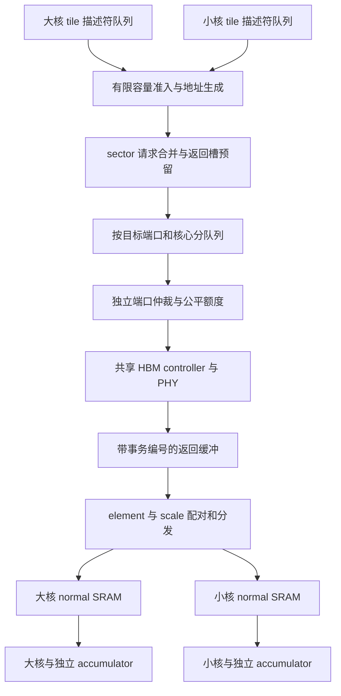

# PLENA MoE 大小核 HBM／DMA 架构设计 V1

日期：2026-09-05。状态：**完成源码核对的设计提案；新 DMA 尚未实现或测得收益，不是 RTL 冻结契约。**

## 1. 架构决定

保留一个共享 HBM 系统及其 DRAM 命令调度；在计算核与 HBM 之间实现
**多客户端、按目标端口分队列、带事务编号与有限返回缓冲的张量 DMA**。
大小核各自保留 normal Matrix SRAM、activation SRAM、accumulator 和 tile
状态。共享的是搬运服务，不共享可被两个核同时改写的计算状态。

本阶段两边均 normal。未来 transpose 发生在核侧放置／读取适配器，
不能要求 HBM 按核的大小保存两份权重，也不能把整张图的后续功能算作已完成。

**先校准后端，再改 DMA，再评估核形状。** 当前证据存在粒度合同不一致；
之前 126 次运行证明既有模型的数值、容量和重复性，不能继续用其绝对耗时
或排序作为硬件选型依据。见第 2 节。

## 2. 证据、疑点与必须先做的校准

| 核对项 | 已确认的事实 | 尚不能得出的结论 |
|---|---|---|
| 数值实验 | 相同输入和路由，完整 Gate/Up/SwiGLU/Down/combine 已执行 | 计算时序或真实芯片已校准 |
| 加载等待 | Qwen B8 单核旧模型 1.243460 ms 中，weight-ready wait 为 1.147045 ms | HBM 一直满载，或者 DRAM 控制器就是主因 |
| 请求放大 | 关闭缓存时，单核上层记账 60,162,048 B，大小核 76,283,904 B | 这些数已经等于物理 HBM 总线实际字节 |
| DMA | 64 个共享上层名额；每核最多当前＋一个预取 tile；只在 tile 内合并相同 64B 地址 | 足够的平均在途数、足够的预取距离 |
| Rust HBM 入口 | `access()` 在请求被接受前持有全局异步锁，被拒绝则占着入口重试；接受后释放，完成可以并行 | 所有内存访问都串行，或删除锁就一定加速 |
| RTL | `hbm_sys` 有一组 matrix 输出；element/scale 两条 TL 通路与配对；`tl_master` 按 LOAD_AMOUNT 发一组请求再等回复 | 这些接口已经是两个独立矩阵核的多事务 DMA |

### 2.1 新发现：16B 与 32B 的源码合同不一致

本机 Rust `lib/ramulator/src/raw.rs` 为 HBM2 使用
`internal_prefetch_size=2`、`channel_width=64`，得到 16B。
`model.rs::MemoryTimingModel::read` 因此把一个上层 64B 请求拆成四次 16B 调用。

但本仓库 Nix 固定的 Ramulator 提交
`b3efdc5019a312874961a8c226097eb0581f2b5f` 的 HBM2 源码使用
`internal_prefetch_size=4`；其控制器从 DRAM spec 获取事务粒度，DQ=64
对应 32B。GenericDRAM 接受小于一个事务的请求，故 16B 请求不一定报错。
**源码不一致已经确认；运行中的动态库是否完全对应此构建、子粒度请求
如何合并及占用数据总线，仍必须运行时核实。** 不可直接声称总线流量恰好翻倍。

来源：[本地 raw.rs](../transactional_emulator/lib/ramulator/src/raw.rs)、
[本地 model.rs](../transactional_emulator/lib/ramulator/src/model.rs)、
[固定版本配置](../transactional_emulator/pkgs/ramulator2/default.nix)、
[固定版本 HBM2 spec](https://github.com/CMU-SAFARI/ramulator2/blob/b3efdc5019a312874961a8c226097eb0581f2b5f/src/ramulator/dram/impl/HBM2.cpp)。

P0 接口校准必须输出并验证：loaded-library 身份、native transaction bytes、
tCK、控制器／pseudochannel 数、地址路由函数、上层 bytes、后端 accepted
requests、actual RD/WR command count 和数据总线占用。让 C++ 暴露这些字段，
不要在 Rust 再写一套易过时的常数。只有实际 RD 命令等价性成立，才能将
`RD_count × native_bytes` 称为 DRAM 传输字节。

用连续地址、跨 native 边界、重复地址及跨 channel 四类微基准验证；64B
logical line 在 native=32B 时应覆盖两个 sector，其完成依赖两者各一次有效返回。
若后端合并命令，分别报 accepted 数与真实命令数。错误粒度应启动即失败。
旧 64B 计数更准确的名称是 `upper_read_bytes`；它并不自动代表物理总线字节。

### 2.2 第一个架构边界

这里设计的重点是 **Tensor DMA／互连前端**。底层 HBM controller/PHY
继续负责 ACT/PRE/RD/WR、refresh、bank/row 时序及合法命令重排。
不在 DMA 中再造一套与 DRAM scheduler 冲突的行命中优化器。
AMD 官方资料也区分应用侧 AXI 访问与控制器内部重排；这些资料用于协议／
架构原则核对，不表示 PLENA 使用了该型号 IP 或相同参数。
[HBM 系统性能因素](https://docs.amd.com/r/en-US/pg276-axi-hbm/HBM-Performance-Concepts)、
[控制器重排层次](https://docs.amd.com/r/en-US/pg276-axi-hbm/HBM-Reordering-Options)。

## 3. 图中符号与存储合同

本文用 D 表示模型宽度，F 表示专家中间宽度，E 表示专家数量。
Gate/Up 权重是逻辑 `[F,D]`，Down 为 `[D,F]`（均按输出行存储）。
草图 `(E_hidden,N*E_hidden)` 中的 N 不作为可执行接口定义；它与核心 N
维的关系不明确，必须从模型 manifest 的实际 shape 获取，不能猜成专家数量。

核心 tile 用 `(Tm,Tk,Tn)`。当前 Rust 家族 `Tm=Tn=BLEN, Tk=MLEN`，
以后可扩展独立三维。MLEN 是核心一次处理的 K 长度，不是 HBM 原生事务大小。
`BlockSize` 是量化分组长度，当前本地格式为 8，不等于 BLEN。

连续 K 范围的 element 和 scale 地址分别为：

```
element_addr = element_base + output_row * element_row_stride + k0
scale_addr   = scale_base   + output_row * scale_row_stride   + floor(k0 / 8)
scale_count  = ceil(((k0 mod 8) + valid_k) / 8)
```

上述 byte 公式仅针对当前 1B element、1B scale 格式。V1 限制 k0 按 8 对齐，
tail 使用 valid mask；最后一块按 ceil 取 scale，不能盲用 `MLEN // BlockSize`。
小于 native burst 的子区间仍需追踪所需 byte mask 与 sector mask。

**保持同一份 encoded HBM 权重供所有核心读取。** 不把专家永久分配给某一
种核，不按未知的 hot expert 提前复制权重。不同核心从同一个二维视图生成
不同的读取窗口。首次 DMA 对照固定旧 HBM 布局；布局优化另做消融。

## 4. 数据路径与控制路径



控制路径反向传递 slot 可用数、最老未就绪 tile、消费进度和错误；这些反馈
必须有同步寄存器／FIFO，不能形成组合 ready 环。两条 normal SRAM 写入
通路可以同时推进，但其总端口数／宽度必须计入资源预算。

## 5. 请求侧：多核可以并行发，不能一起堵

### 5.1 描述符与所有权

一个 `TileDescriptor` 至少包含：epoch、core_id、job_id、tile_id、slot_id、
slot_generation、projection、matrix_view_id、n0/k0、valid_n/valid_k、
element/scale base 与 stride、format/block_size/scale_axis、placement、优先级。
V1 建议按 128B descriptor 预算；编码后逐字段验算。

准入在任何 HBM 请求之前完成：目标 packed/decoded tile 空间、completion
bitmap、等待者记录与返回容量均须有归属。地址生成按行区间产生请求，
不能提前物化整模型每一个 byte 的请求表。已分配的条目不足时反压生成器。

### 5.2 三种编号不能混为一谈

- 上层 tile：计算和 SRAM 生命周期单位。
- logical line：例如 64B，合并地址与保存 sector 的单位。
- native request：后端实际接受的事务单位，由 P0 查询确认；当前固定源码预期 32B。

一个 line 可有多个子事务，分别路由、接受、返回。不能按 line 首地址把整个
64B 发往同一个 channel；在交错映射下，两个 sector 可能属于不同 channel。

### 5.3 按目标端口分队列

第一版以真实后端可独立接受请求的目标为 output port，逻辑上维护
`Q[port][core][element_or_scale]`。例如 8 个已验证 output port、2 核、2 类
得到 32 个虚拟队列，实际条目从有限共享 pool 分配。
channel、pseudochannel、AXI port 并非同义词；端口数不能直接复制图中的方框数。

某个端口拒绝请求，只保留该端口／队列的 pending 项，其他可用端口继续尝试。
`try_accept()` 不得 await 后端接收，也不得持全局锁跨越模拟时间。
模拟器仍由单个 owner 串行调用 native model，保护模型线程安全和唯一 tick
链；改变的是调度进展规则，不是无锁并发调用 C++。

每周期可以尝试／成功的次数受明确的 request-port 参数限制。不得在同一
模拟时刻无限次提交所有请求。对于真正只提供一个 ready 的总线接口，不能
模拟成八个独立 ready：需暴露真实的多个入口，或承认该桥存在的顺序约束。

V1 数值实验先支持 readonly weight element/scale。完整 RTL 接入时，已有
vector/activation 与 writeback 客户端也必须进入同一带宽／名额仲裁，另设
流类别和最低进展保证；不能让旧 vector 通路在预算外另享一套 HBM。当前
两核、两类的队列和容量示例不包含并发 vector/writeback 性能承诺。输出 HBM
store 若加入基准，必须同时加入所有架构的测量边界，并考虑读写方向切换。

### 5.4 公平性

以 native byte 计费的轮转公平仲裁作为起点；大核不固定拥有 3/4 HBM。
3072:1024 是乘法器比例，不是实际搬运需求比例。

每个活跃核保留最低 line／waiter 名额，其余名额共享。128-line 候选可先用
每核 16 个保留项、96 个共享项；这只是实验起点。借给暂时空闲核的额度
不能撤销已经发出的事务，新需求等待额度返回，并记录唤醒延迟。

优先服务最老 demand tile 的最后缺失 element/scale，再按年龄与 byte-deficit
轮转；紧急提升最多连续服务 4 个可接受事务，然后给其他可服务的老请求
机会。记录最大等待，防止“只优先 scale”造成新的饥饿。
不同端口独立作出选择，有限总入口带宽仍统一计费。

## 6. 合并、预取与返回：不要再做通用缓存瓶颈

### 6.1 合并在途请求，默认不缓存所有 element

使用有限的 line table/MSHR：key 为 `(memory_epoch, aligned_address)`，
记录 requested/inflight/valid sector 位图以及 waiter 链表。
不同核、相邻 tile 要求同一 readonly sector 时只发一次，其返回可以分发给
多个已准入的 destination；扇出有读口、写口与每个 waiter 的成本。

晚加入的需求可以补发该 line 尚未请求的 sector，不能重发已经 valid 或
inflight 的 sector。line table 满、waiter 满均反压，不得偷偷绕过上限。
最后一个 waiter 完成 copy 后即可释放，不要等整个 tile 能计算才释放返回槽。

element 为主要流式数据，默认走 bypass；不要求所有 miss 先付通用 cache
lookup 再付 insertion 成本。单核与双核均能使用同样的 bypass、合并和端口。

### 6.2 scale 单独做小容量复用

以 Tk=128、block=8 为例，每行只需 16B scale。同一 64B scale line 可以
包含几个相邻 K tile 的尺度。Tk=192 时是 24B，某些 tile 会跨 sector/line。
仅合并“同时在途”的请求不足以复用先后到来的相邻 tile。

可增加 4KiB scale payload + 1KiB tag/control 的 banked retention buffer，
用完当前 K 扫描区间后优先回收；这是单独可关闭的优化，不是必须缓存全部
权重。容量、冲突、命中、读写端口服务都计费。短暂保留只适用于不可变权重；
权重更新需 drain、epoch 切换及 invalidate，不能跨版本返回旧 scale。

### 6.3 字节预算约束预取距离

将 DMA 描述符窗口与计算 tile 发射解耦，每核从 2 个 slot 扩展为可配置 2/3/4，
但先按字节检查容量，不能直接增加 slot 数而不增加记账。
当前 BF16 实验每 slot 为 `Tn*Tk*(2+1+1/8)` B：

| 核形状 | 一个 slot | 三个 slot | 四个 slot |
|---|---:|---:|---:|
| 单核 B4/K1024 | 12,800 B | 38,400 B | 51,200 B |
| 大核 B16/K192 | 9,600 B | 28,800 B | 38,400 B |
| 小核 B8/K128 | 3,200 B | 9,600 B | 12,800 B |

旧配置每个双核 32KiB weight SRAM，所以大核能放 3 个，不能放 4 个。
四槽实验必须显式重分 64KiB 总预算，例如大核 48KiB、小核 16KiB；单核仍
64KiB。所有 SRAM 类型的转移及实际端口一起列出。

预取服务最老尚缺数据的 tile，完成当前组所有 M blocks 的权重消费后才能
覆盖其 slot。只提高预取距离不会减少计算所需字节，且可能降低局部性；
记录平均 ready tile 深度，而不只记录某次达到了双缓冲峰值。

### 6.4 乱序返回必须有编号

返回 tag 查到 `(epoch, line/sector, destination waiter)`，再找到核、slot
generation、projection 和行列偏移。element/scale 独立返回，按 tile 内容
位图配对；不能用一个公共 valid 信号或“第几个返回”推断它们属于同一块。

AXI 适配器遵守同 ID 的顺序要求，使用多个 ID 时维护有限 transaction table；
不要假设每个请求都有无限的新 ID。TileLink 适配器用合法 source ID 生命周期
跟踪 outstanding 事务，不能简单复制 AXI 的 ID 复用规则。
现有 RTL 为 TL，AXI 只是未来实际 HBM IP 桥的一种实现。
[AXI ID 与返回匹配的官方说明](https://docs.amd.com/r/en-US/pg406-network-on-chip/AXI-ID-Single-or-Multiple-IDs)。

tile 生命周期：`FREE → RESERVED → FILLING → READY → IN_USE → FREE`。
`READY` 要求所有有效 element、所有 scale、放置／解码和 SRAM 写入均完成，
且 error=0。只在真正提交写入后更新 bitmap。释放需要消费完成、所有 copy
完成且没有 outstanding waiter。错误进入 ERROR/DRAIN，迟到回复不能命中新
generation。generation 回绕前需 drain；不支持的格式／transpose 直接拒绝。

### 6.5 避免返回反压变成全系统死锁

请求发出前预留返回数据容量和 destination slot。返回能够写入 packed storage，
无需等待 scale 到达或计算核空闲。不得拿着返回缓冲等将来才分配的 SRAM。
仲裁确保 scale 和 oldest demand 均有进展；预取不能耗尽所有 demand 名额。

返回缓冲必须 banked；一个核的 destination 写口阻塞时，其他核的 ready
responses 可以继续排出。多个 fanout destination 会拉长 line 的占用时间，
需要分别记录，不可假定 multicast 免费。最终 liveness 以 backend 在有限时间
完成被接受请求、SRAM sink 最终接收为前提；后端错误需要可报告的 drain 机制。

## 7. 大小核 normal SRAM 与未来 transpose

统一 DMA 返回 encoded element＋scale。当前 Rust 放置适配器将其解码为
BF16，并使用已计费的共享 vector actor；旧 RTL 向 Matrix SRAM 传递 MX
元素／scale，算术路径不同。**BF16 是当前数值实验的存储契约，不能直接
宣称真实 RTL 的 normal buffer 必须存 BF16。** 两条路径须独立标明 storage format。

新 DMA 首次比较保持原有 decode 算法和服务收费不变。若增加独立 decode
引擎，要在单核和双核上一起增加，并列面积／功耗／端口成本，作为单独消融。

正常放置按各核 Tn/Tk 与 stride 写入其私有 SRAM。transpose 后续只扩展
placement/read view；MX scale 绑定原量化分组轴，不能转置 element 却沿用
错误的 scale 分组。可采用先按原分组解码，再在 BF16 SRAM 中转置的路径，
但转换及存储成本必须计费。需 MX 输出时还要明确重分组／重数量化规则。

## 8. 布局优化：先处理 stride 与通道分布，再考虑权重重排

在上述固定 Ramulator 源码、native=32B、8 个 controller、默认交错下，
channel 取地址 bit[7:5]，intra-channel 地址移除这些位。
该推导必须经 P0 与实际动态库对齐；不能直接移植到任意 HBM IP。
[固定版本 channel mapper](https://github.com/CMU-SAFARI/ramulator2/blob/b3efdc5019a312874961a8c226097eb0581f2b5f/src/ramulator/memory_system/channel_mapper/impl/cache_line_interleave.cpp)。

例如 D=2048 时，element 行跨度为 2048B，scale 行跨度为 256B，两者均为
8×32B 的整数倍。**相同行内偏移在每一行都从相同 channel 开始。**
Tk=128 的 scale 只需 16B，集中于一个 native sector；旧 64B 读取会连带读
另一个 sector。增加核心数未必增加所用 channel 的覆盖。

独立布局实验首先测试 scale 行跨度从 256B 改成 288B，使相邻行起点轮换；
可再测试 element 行跨度从 2048B 改为 2080B。该规则只是特定 mapping 的
候选，不是固定新 ABI。必须同时报告 padding 存储增长、真实请求数、行命中率、
端口分布与模型耗时；改善 channel 均衡可能损失 DRAM row locality。

两种核共用同一个布局；Compiler 只改变 view 的独立 stride/base 与实际
编码存储，不改变数学权重、量化分组或路由。禁止为大小核各做一份权重而
把容量和加载成本隐藏掉。为诊断 HOL、预取和布局，不能一次同时打开所有优化。

## 9. 带宽、在途容量与数据端口预算

用测得的 latency 和目标带宽决定在途字节：

```
required_outstanding_bytes ≳ target_BW_bytes_per_second * mean_latency_seconds
native_OT ≳ ceil(required_outstanding_bytes / native_bytes)
line_slots ≳ ceil(required_outstanding_bytes / 64)
```

这是平均稳态的必要容量估计，不是成功预测器；不均衡、p95/p99 延迟、协议
开销、依赖关系和返回反压还会降低吞吐。
[官方 outstanding 与吞吐关系](https://docs.amd.com/r/en-US/pg313-network-on-chip/Throughput-Latency-and-Outstanding-Transactions)。

**仅作容量示例**：64GB/s、100ns 要约 6,400B＝100 个 64B line，或 200 个
32B native 事务。64 个上层 line 在该假设下的窗口上限仅 40.96GB/s；这不
表示 PLENA 实测 latency 就是 100ns。不能把平均 end-to-end 等待直接代入。

候选规模如下，全部是显式逻辑容量预算，尚非综合面积：

| 项目 | 128-line 候选 | 512-line 候选 |
|---|---:|---:|
| 32×128B tile 描述符 | 4KiB | 4KiB |
| 16×128B active tile 状态 | 2KiB | 2KiB |
| line table，每项 32B | 4KiB | 16KiB |
| waiter pool，每 line 平均预算两项、每项 24B | 6KiB | 24KiB |
| native queue/tracker，每 line 两项、每项 16B | 4KiB | 16KiB |
| 返回 payload，每 line 64B | 8KiB | 32KiB |
| scale retention，data＋tag | 5KiB | 5KiB |
| 接口 pipeline payload | 1KiB | 1KiB |
| 队列头尾、仲裁与计数寄存器预算 | 1KiB | 1KiB |
| 合计 | **35KiB** | **101KiB** |

waiter 是共享 pool，不是假定每 line 最多两个消费者；超出总 pool 必须反压。
native tracker 的两项前提是 P0 确认 32B sector；换后端要重算，不能照抄。
128B tile 状态条目为至多 256 个 destination fragment 保留完成位图及计数，
不保存逐 element 的无限位图。fragment 完成以 copy 被提交为准，重复返回
不得重复计数。地址展开若超过此上限则增加显式状态预算或拒绝该形状；
完整矩阵不在这里展开成一张巨大的全局位图。

128-line 候选可放进旧 cached 实验的 40KiB cache＋4KiB staging 总预算，
剩余 9KiB 为未使用预算，不是免费隐藏结构。512-line 候选建议明确给 128KiB
传输子系统预算；比旧 44KiB 多 84KiB，必须等量从其他 SRAM 减去或报告面积增长，
且单核／同构／异构一视同仁。ECC、综合后的 tag 位宽、crossbar、FIFO 实现
和每种 RAM 端口面积仍需 PPA；不能用“容量装得下”替代硬件验证。

返回通路候选为 8 个 32B bank，各 1R1W，1GHz 下理想读／写各 256B/cycle；
这是总吞吐上限，不是任意地址都能达到。tag 分配、bank 冲突、fanout 与
sink backpressure 必须模拟。128-line 在 100ns 下窗口仅支持约 81.92GB/s，
即使端口有 256GB/s 理论能力也用不满；是否扩大规模由测量决定。

前端服务率同样不能免费：候选设每周期总共展开至多 4 个 destination span，
line table 分 4 bank，每 bank lookup 延迟 2 周期、最多每周期接受 1 次
lookup 和 1 次状态更新；同地址冲突须 forwarding 或收费 stall。line hash
采用可配置地址异或，不能保证所有 stride 都无冲突。native issue 候选为每个
真实 output port 每周期最多接受 1 个事务。返回 fanout 的总 copy 预算为
256B/cycle，等待者多时分多个周期完成。所有这些是待校准的服务参数，
必须出现在配置／报告中，不能把 host map 查找视为零周期硬件。

SRAM 写入带宽和 decode 吞吐须独立计费，不能在收到 HBM 数据的同一时刻
免费写完整个 tile。保持所有核总 DMA／返回服务能力相同，单核也可使用全部
总服务能力。大小核多一个客户端，不自动获得第二套总线带宽。

计算端口仍是另一项待校准资源：当前流水模型单核 K1024 假设每周期读
2048B BF16 输入，同构双核合计 512B，当前异构合计 640B。这些并不等宽。
DMA 消融先固定各自核模型，以隔离前端效果；最终 iso-area 架构比较必须
进一步统一或计价这些计算 SRAM 端口，不能继续仅比较乘法器数量。

## 10. Rust 与 RTL 的实现拆分

| 层 | 建议模块／改动 | 明确职责 |
|---|---|---|
| 后端契约 | ramulator C API + Rust `BackendCaps` | 查询 native 粒度、路由、时钟及真实命令计数 |
| 请求接口 | `TensorDma` 与 versioned tile descriptor | shape/view/slot 准入，不暴露 compute shape 到 DRAM scheduler |
| 地址展开 | `RowRequestGenerator` | element/scale 子区间、sector mask、尾块与溢出检查 |
| 合并 | `LineTable`、`WaiterPool` | 一次 native 读取对应有限多个 copy destination |
| 调度 | `OutputPortQueues`、`ByteArbiter` | 端口独立进展、预算、公平与年龄 |
| 返回 | `ResponseStore`、`TileCompletion` | ID/generation、乱序配对、反压与错误 drain |
| 核侧 | `PlacementAdapter` | normal 写入，BF16 实验 decode 收费，未来 transpose |

Rust 的 native model 只能由原 owner 驱动，保持唯一 ticker，按有限接受端口
逐周期提交；现有全局 await-lock 路径保留为 reference mode。
CLI 输出上述 capabilities 与配置 hash，不能只写 `HBM2, channels=8`。
旧 ISA/RTL 默认行为不因实验开关变化。

RTL 接入需改 matrix client 为带 ready/valid、core/tile/slot generation 的
多客户端接口，element 与 scale 各自接收和匹配；维护有限 TL source 表，
验证突发、乱序、下游 stall。当前 LOAD_AMOUNT 组收发状态机可保留作基线，
不能以“复制一份控制器”宣称已经实现共享带宽的多核 DMA。

## 11. 验证顺序与判定标准

| 阶段 | 固定项 | 唯一主要变化 | 能回答的问题 |
|---|---|---|---|
| P0 | 同一 backend、地址与数据 | 粒度／mapping 合同校准，计数器补全 | 计时和字节单位是否可信 |
| P1 | 校准后端、所有核形状、旧布局、总预算 | 独立 output queues；reference FIFO 对照 | 全局队头阻塞损失多少 |
| P2 | P1 | 在途合并及可关闭 scale retention | 重复 native 读取是否减少 |
| P3 | 相同总 SRAM、端口与核 | 合法的 2/3/4 slot 预取 | 是否出现请求断供 |
| P4 | 同上 | byte 公平／年龄／紧急提示 | 是否改善小核饥饿与尾部完成 |
| P5 | P4 | 所有核心共用的 stride 布局候选 | channel 分布改善能否抵消 padding／row locality 代价 |
| P6 | 同一新 DMA、经过校准的计算端口 | 单核／同构／异构几何搜索 | 大小核本身是否有额外收益 |

P1–P5 至少在旧四组 D/F 完整尺寸窗口对所有四种单核、同构双核、异构双核
公平应用；每次两次确定性重复，保留旧校准模型与每一阶段结果。
另加未用于调参的真实 route 窗口与 shared expert，不把 batch32 重组叫 prefill。

正确性门禁：跨 channel 阻塞时另一可用端口有进展；相同 sector 多消费者只读
一次；返回倒序／scale 先到／element 先到均配对正确；tail、非对齐 view 与
超界拒绝；返回 bank 冲突有收费；slot 不提前复用；line/waiter/response 均
不溢出；scale 不被饿死；失败与 reset drain 不使旧回复写入新任务。

性能门禁不能只有总时间，必须同时输出：

- 请求生成、队列等待、backend 接受、DRAM 返回、SRAM 写入、tile READY 的时间戳。
- 各 output port／bank 的请求分布，接受率、拒绝率、平均与峰值在途数。
- useful bytes、upper bytes、native accepted bytes、实际 RD bytes，各自独立。
- 每核因缺 element／缺 scale／缺写口而停等的时长，compute service、ready-depth 分布。
- scale 命中、MSHR 合并、回传 fanout、bank 冲突及最大请求年龄。
- 原始数据／代码／动态库身份，全部 SRAM、控制结构、端口、时钟及服务率。

理想带宽或无限预取只可作为诊断上界，不参加“可实现方案加速比”。若新 DMA
让单核和双核都更快，先将收益归于 DMA；只有异构在相同新 DMA 上胜过强单核
和同构，才能讨论异构增益。未完成 P0 不发布新的硬件收益结论。

## 12. 本次交付与后续状态

本次交付为源码审计、候选架构、接口／资源／状态机约束和验证次序；没有
修改 Rust 执行模型或旧 RTL，没有声称新 DMA 已实现或重新跑得加速。
离线地址分布与预算核算位于
`/scratch/shared/mcl123/plena/outputs/moe_dma_architecture_20260905/`，
只用于检查设计算术，不是新性能实验。

下一步具体落点是 **P0 后端 contract 与微基准**，其结果决定实际 sector
粒度和 output port 数，再实现 P1。无需先选择新的大小核比例或增加 HBM。
