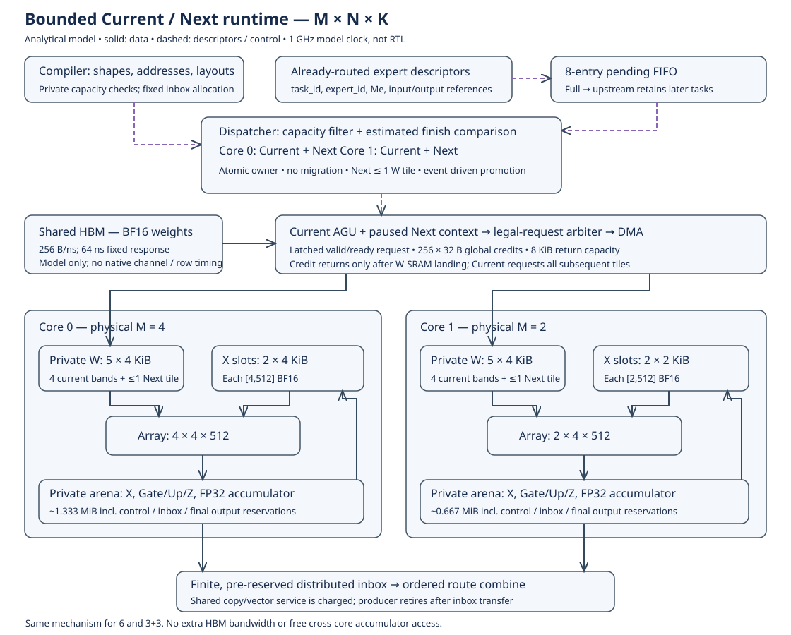

# Bounded Current/Next runtime, 2026-09-30

This implementation is the standalone Rust **analytical** backend under
`research/moe_dispatch/rust`, paired with the Compiler research planner. It is
not the production instruction executor, native Ramulator, RTL, or a complete
LLM inference run. The production datapath and old frozen reports are unchanged.



## Fixed machine and experimental boundary

All dimensions are physical **M × N × K**. BF16 X/weights, FP32 accumulation,
1 ns model cycles, 20 ns dot-tree tail; initiation is governed by actual operand
bank service, result contexts, and preceding K commits, not by that tail alone.

| Resource | Single 6 | Homogeneous 3+3 | Heterogeneous 4+2 |
|---|---:|---:|---:|
| Core shapes | 6×4×512 | 3×4×512 each | 4×4×512; 2×4×512 |
| Physical multipliers | 12,288 | 12,288 | 12,288 |
| Private W slots, 4 KiB each | 10 | 5+5 | 5+5 |
| X SRAM, two slots/core | 12 KiB | 6+6 KiB | 8+4 KiB |
| Private arena: inputs, results, scratch, control | 2 MiB | 1+1 MiB | proportional 4:2, 32 B aligned |
| Total W/X/arena 128-bit 1RW banks | 64 / 24 / 12 | 64 / 24 / 12 | 64 / 24 / 12 |
| Control reserve, included in arena | 4,096 B | 4,096 B | 4,096 B |
| Used control state | 2,752 B | 3,744 B | 3,744 B |
| Remaining control reserve | 1,344 B | 352 B | 352 B |

Global HBM model: 256 B/ns, fixed 64 ns response latency, **256 credits × 32 B**,
8 KiB shared return capacity. A credit covers a sector from acceptance through
its SRAM landing completion. The response ledger is not another payload buffer.
No packed format, scale stream, codec, or decode buffer is introduced.
Storage totals are equal; this is **not** a synthesis-based equal-area claim.

## Compiler and runtime interface

The workload `experts[]` index is the immutable `task_id` within one layer.
`id`, `Me`, `H/F`, `weights[gate/up/down]`, and `token_indices` supply expert ID,
dynamic routed row count, model configuration and input mapping. The same index
selects `engine_layout.whole[task][core]` and each core's pre-reserved result inbox.
Session `phase` records Gate(0), Up(1), activation(2), Down(4), result drain(5).
No task migration or expert splitting is enabled in this runtime.

Compiler provides layouts, addresses, legal candidate capacities, shape templates,
route-rank output reduction and the control ledger. Runtime makes the owner
decision from already-routed tasks and executes the templates. The full upstream
route/descriptor table is already charged in the arena; the 8-entry pending FIFO
is only the admission window. One descriptor enters per cycle when space exists.

Control flow is descriptor/ownership/ready state. Data flow is HBM → W SRAM →
array; resident X → private expert workspace → X slots → array; array → private
accumulator scratch → gate/up/Z or producer output → pre-reserved result inbox.
Global combine uses captured route-slot order, then shared-expert addition.
HBM input reads and routing computation are outside this window's timed scope.

## Task and storage state transitions

| State | Entry and allowed action | Exit guard |
|---|---|---|
| Unbound / pending | Upstream retains descriptors while FIFO is full | Head descriptor and an empty, capacity-compatible Next |
| Next | Atomic FIFO pop + immutable owner + Next allocation | Current absent; charged promotion completes |
| Next with tile | Reserve at most one existing W slot; request gate's first tile | Same promotion guard; tile may still be in flight |
| Current / WAIT_DATA | Gather X; attach inherited tile; continue Current AGU | Actual W/X ready, K dependency and result context available |
| Current / execution | Gate → Up → activation → Down; all tiles continue streaming | All issues, commits, conversions and output inbox copies finish |
| Retired | Release workspace/current context; inbox remains reserved | Layer combines after all experts retire |

Idle is persistent. Promotion never requires `Done && Ready` pulse coincidence.
The inherited W slot remains identical across Next → incoming/gather → Current
run. Response identity is `(task, core, phase, tile, slot, offset)`; the observer
also assigns a serial number to detect duplicate completion.

| Resource | Allocation / reservation | Release |
|---|---|---|
| Pending entry | Accepted upstream descriptor | Atomic Next binding |
| Next context | Owner commit | Promotion transfers identity to Current |
| W slot | Before first sector is selected, including Next in-flight bytes | Last actual operand SRAM read completes |
| Return credit / 32 B buffer | DMA `valid && ready` | Response safely written into reserved W slot |
| X operand slot | Copy scheduled into an available slot | Last consumers' reads complete; can overwrite after ready/busy guards |
| MAC result context | Accepted MAC issue | Ordered accumulator RMW commit |
| Expert workspace | Current promotion after previous retirement | Producer output copied into pre-reserved inbox |
| Inbox / final output | Compiler layer allocation | Retained through the ordered combine, never borrowed by Next |

Current can hold a four-band group; Next can hold one tile. Thus five W slots
suffice on each dual core. Next does not reserve X, accumulator scratch or another
expert workspace. Its standalone capacity is checked before binding, and its
workspace is acquired only when the previous Current has retired.

## Scheduling, prediction and arbitration

Both policies take the FIFO head and exclude occupied Next contexts and cores
whose private arena cannot fit the expert. `fifo` prefers idle Current contexts,
then round robin; `dynamic` minimizes an **estimate** of finish delay. Neither
policy scans the entire layer, consults future event timestamps or learns an
expert-affinity table. The window is bounded queueing, not an out-of-order window.

For one projection, issues = ceil(Me/Mc)·ceil(N/4)·ceil(K/512). Whole-expert
prediction covers both Gate/Up and Down, ongoing HBM throughput, nominal operand
service and vector work. It does not predict all arena conflicts or copy queues.
Remaining Current work is updated from issues actually
accepted, with a drain estimate; it is not a countdown that expires while stalled.
Predicted first-tile delay includes HBM latency, credit-limited aggregate bandwidth
and W landing. These are heuristics; they never permit an early issue or release.

Owner selection charges `4 + 4·eligible_cores` cycles on the shared control port;
promotion charges 2; W descriptor install charges 2. For the four runtime modes,
total descriptor service is `sum_bindings(4+4·eligible_cores) + 2·tasks + 2·weight_tiles`.
MAC issue and K commit retain the existing operand-bank, pipeline and accumulator
RMW timing; this model does not add a descriptor access per MAC issue. All policies
use the same charge. Timing/area of a physical implementation is not established
by these analytical charges.
Promotion keeps its own completion event/time: a later lease on the control port
cannot delay an already-completed promotion. Completed promotions are applied
before new dispatch service starts. A regression specifically checks this case.
`dispatch_audit` records owner and eligible cores at each binding, as host-side
observation only; it is not a new hardware history table.

Each core exposes a Current request first, otherwise its one Next tile. Only
legal reserved requests enter global arbitration. The experimental default is
round robin with aging at 64 cycles; optional `urgency` compares ready-tile counts
after aging. This is not a trained Slack-Time predictor. Aging applies to service
opportunities and cannot guarantee progress when the backend holds `ready=0`.
The chosen request is latched until `fire`: address, owner, slot and offsets do
not change under backpressure. Its slot reservation persists; the global credit
is deducted only on `fire`. There is one issuer, so selection creates no hidden
second credit reservation. Completions are processed before new accepts each cycle:
`used_next = used + accepted - landed`, always within capacity. At most 8 sectors
are accepted per 1 ns cycle at the default 256 B/ns; there is no additional token
bucket. Credit returns wait for bank landing, not the full expert's retirement.

## Verification and performance protocol

Rust tests cover stable backpressure, zero-request arbitration, credit release,
same-cycle reuse, duplicate returns, in-flight promotion, bounded Next storage,
no-progress diagnostics, tail geometry and drain invariants. `test_runtime.py`
adds >8 experts, all stages, 128 credits with >129 reads, both early and late data,
three organizations × four policy modes, M/N/K tails and shared-expert combine.
`trace_payload.py` executes seeded BF16 data through finite W/X slots following
the **actual timed Rust DMA addresses, issues and K commits**, then compares an
independent reference bit-for-bit. This is stronger than merely checking counters,
but is not a trained-weight numerical run of the large performance inputs.

`run_experiments.py --suite runtime` runs captured DeepSeek-V2-Lite BFCL B2/B4/B8/B16
routes in 6/33/42 with FIFO/no prefetch, dynamic/no prefetch, FIFO/prefetch and
dynamic/prefetch. G=4 and all machine resources are fixed. Every complete JSON
report must match byte-for-byte over two repeats. Historical `matrix/toy/sensitivity`
suites explicitly retain `runtime_fsm=false`; they are not the repair's baseline.

CSV records cycles, µs/ms at 1 GHz, useful/issued MACs, tile issues, padded HBM
bytes and sector counts, Next readiness, per-core memory peaks and control service.
`core_front_states.csv` is mutually exclusive per core-front observation; it
overlaps arithmetic and the other core. It is never summed into wall-clock time.
The run panics with a wait-state snapshot on a timeout or lack of progress.

## Acceptance coverage

| Task requirement | Executable evidence |
|---|---|
| 1. First task from idle | Rust `all_organizations_drain`; Python startup case |
| 2–4. >8 tasks, unique owner, occupied Next | 13-expert Python case; event replay checks atomic owner/state history |
| 5. Fetch all subsequent tiles/phases | 513×19 case checks Gate/Up/Down requests and exact total bytes |
| 6. Idle before data | In-flight promotion Rust test; 500-cycle latency/backpressure Python case |
| 7. Data before previous retirement | Python early-prefetch case observes ready Next at promotion |
| 8. Stable backpressure | Rust compares the entire latched request for 19 blocked cycles |
| 9. Urgent without request | Rust no-grant test |
| 10–12. Exhaustion, >credit reads, same-cycle return/accept | 128-credit Python run; Rust one-credit landing/reuse test |
| 13. In-flight promotion identity | Rust Next→incoming response test; stable tag/slot assertions |
| 14–15. K order, bit-exact, tails | Actual event replay across 3 organizations × 4 modes, plus Down-K/shared tests |
| 16. Drain and capacity | Assertions on every point and repeat; finite slot/tag/context ownership |
| Stuck or duplicate operation | No-progress wait snapshot and duplicate-return negative tests |
| Completed control service | Promotion completion cannot be delayed by a later port lease |

## Reproduce

Use Python 3.11 with NumPy, a matching Compiler checkout and Rust 2024 toolchain.
From this directory (paths can be relocated):

```sh
export PLENA_DISPATCH_COMPILER=/path/to/PLENA_Compiler/research/moe_dispatch
export CARGO_TARGET_DIR=/tmp/plena-runtime-fsm-target
cargo test --locked --manifest-path rust/Cargo.toml
cargo build --release --locked --manifest-path rust/Cargo.toml
python -m unittest discover -v
python run_experiments.py --suite runtime --output /path/to/new/results --workers 4
```

Run `python -m unittest -v` in the Compiler research directory as well. Each campaign
freezes the binary, source bundle, inputs, configurations and repeat receipts.
Uncommitted paired development is supported through `PLENA_DISPATCH_COMPILER`;
the receipt records the selected Compiler content hash, not only a Git label.
